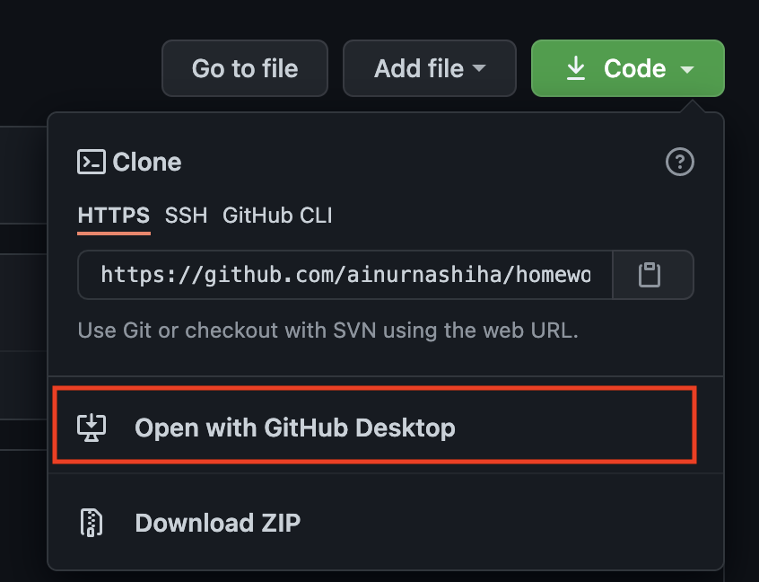
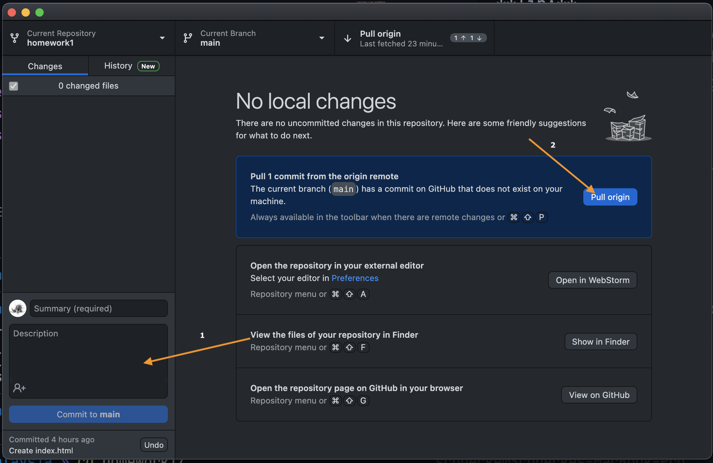
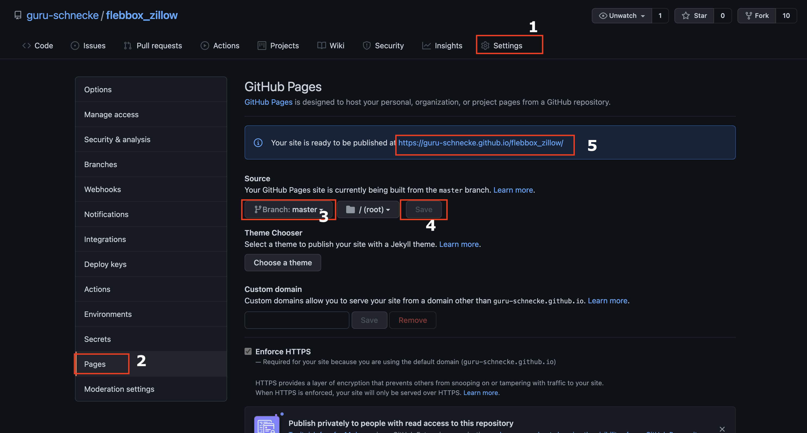

# Homework 

## Starting a homework

Follow these steps when you begin a homework.

* Fork repo.

*  You'll know you're on the right page if it says "forked from" in the upper left corner.

* MAKE SURE YOU ARE WORKING ON YOUR OWN FORK BY CHECKING FOR **YOUR NAME** IN THE TOP LEFT CORNER. 

*  Do your homework.

---
## Submitting a Homework

When you've finished your homework, all you have to do is get it online.  To do this, follow these steps:

1. write message describing what you did ad click commit to main(master)

2. push origin
 

- In your browser, go to your Github repo for the homework. You should now see all of your completed homework there.  Once you confirmed you're homework is up online, you can:

- Click on a new pull request. 

## Publishing

- Go to settings tab and then pages.

    
    >**Pull requests** let you tell others about changes you've pushed to a GitHub repository. Once a pull request is sent, interested parties can review the set of changes, discuss potential modifications, and even push follow-up commits if necessary. We will be using pull requests to submit homework. 
    
    
    
- Make sure you are comparing the correct repos. The **base** _(first repo)_ should reference the homework assignment. The **head** _(second repo)_ should reference the work you completed.
    

- Fill out your submission. When submitting, include the following:
    - on a scale from 1 to 5, how comfortable were you with this assignment?
    - what was a win you had with this assignment?
    - what was a challenge you had with this assignment?
    - is there anything that you'd like some further information on?
    - other stuff on your mind? work with anyone?  tell us about it!

- Click `Create Pull Request` to submit your work!
